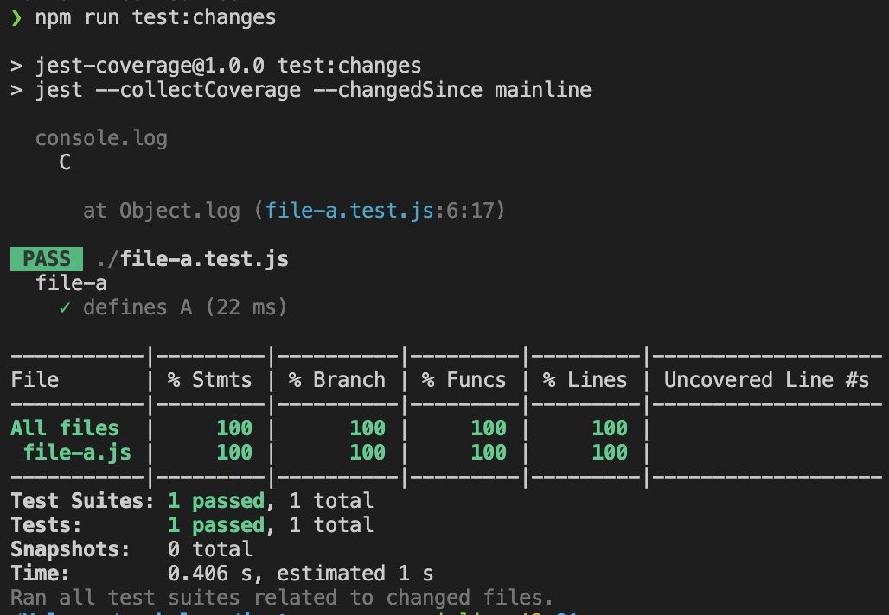
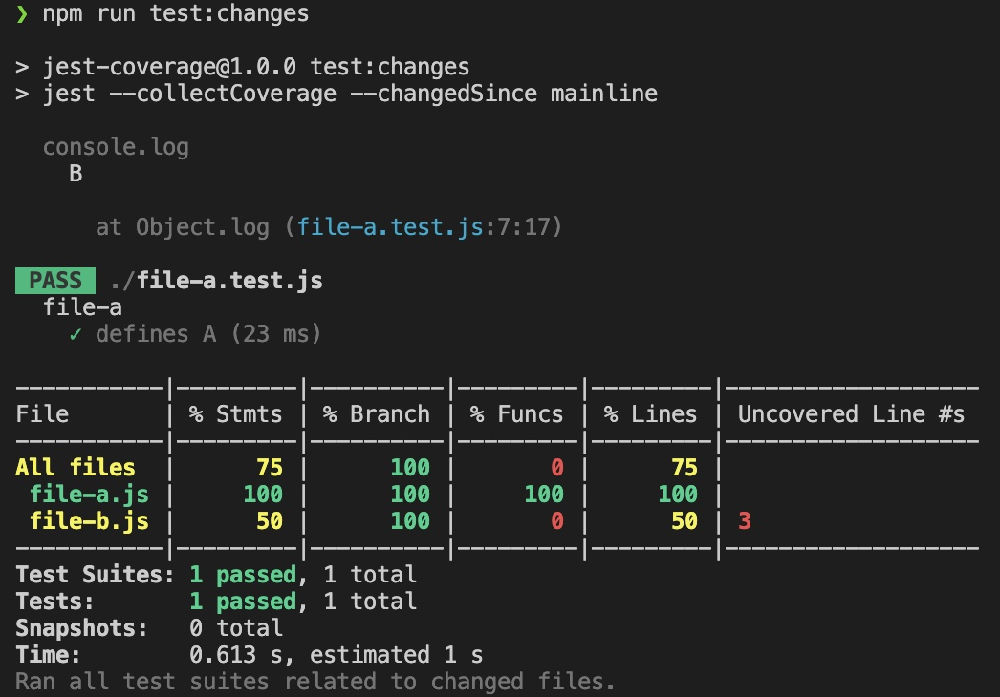

# jest coverage issue
When running `jest` with `--changedSince` and `--collectCoverage` I've noticed that the files being added to the coverage report can include more than just changed files.

There are 2 scenarios that cause a different output which are described below.

## Scenario 1
1. Add a comment to `file-a.js` (so this file gets picked up by `--changedSince`)
1. Run `npm run test:changes`

You can see that `file-a.js` is included in the coverage result, but `file-b.js` (which is required from `file-a.js`) is not included. I would expect this behavior as `file-b.js` was not changed at all.

## Scenario 2
1. Add a comment to `file-a.test.js` (so this file gets picked up by `--changedSince`)
1. Run `npm run test:changes`

You can see that `file-a.js` AND `file-b.js` is included in the coverage result. In this case, it's probably hard to know what files should be included in test coverage, but it's leading to some incorrect coverage being reported.

## Questions
- Is it possible from a test file to essentially tell `jest`/`istanbul` not to include some imports into the coverage report?
    - _In this example, we might add a comment to `file-a.test.js` to ignore the imported `file-b.js` for coverage because we may only be using it for mocks or types._
- Is it possible that when a test file is modified and imports several other non-modified files, to run all tests that are related to those files?
    - _In this example, `jest` might see that `file-b.js` is imported from `file-a.test.js` and run all tests that import `file-b.js` (e.g. `file-b.test.js`)_